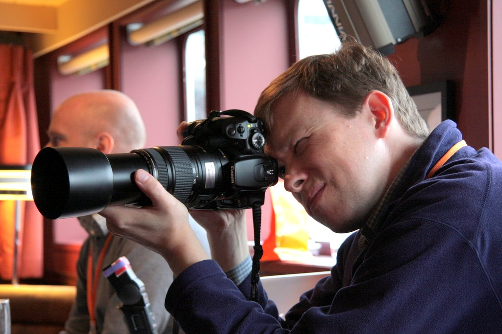

#Authors#
This book is crowd authored and all contributors have added a brief biography  below.

Contributing to this book is as simple as sending a pull request to this repository.

###Kevin Giszewski###
Kevin Giszewski is from Columbia City, IN USA and has been developing Umbraco for about two years.  Kevin has developed web in earnest since 2000 covering both the LAMP and .NET stacks. 

Kevin has an Associate of Computer Science degree from Purdue University, a software Bachelors from Western Governors University and is currently working towards an Information Assurance and Security Masters from Western Governors University.

Kevin is employed as a Senior Web Developer by the University of Notre Dame Mendoza College of Business located in South Bend, IN.

You can follow Kevin on Twitter at: http://twitter.com/kevingiszewski

###Mark Kimmet###

##Photos##
All of the photography in this book is copyrighted and provided as a courtesy by [Doug Robar](https://twitter.com/drobar) who is the official Umbraco Photographer.  Thank you Doug for allowing them to be used #h5yr!

For even more wonderful pictures by Doug, please visit his [Flickr](https://www.flickr.com/photos/percipientstudios/sets/with/72157605372962113)!

>Photo of Doug Robar

[Next> 01 - Developer Tools](01 - Developer Tools.md)