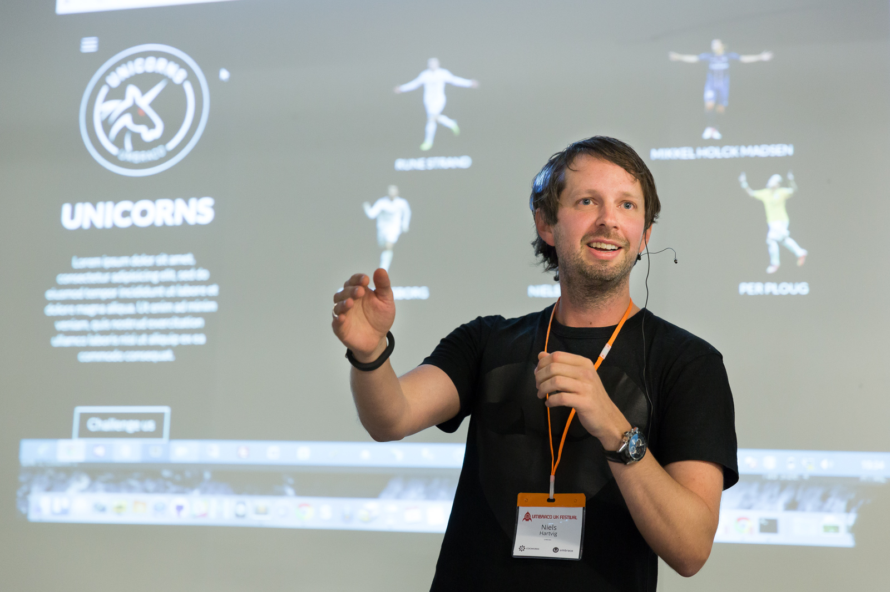

# Core Team

>Photo by: Doug Robar

The core team is the team that has made Umbraco what it is today.  While HQ is in Denmark, many core team members live other places around the world.
## Niels Hartvig
Twitter: http://twitter.com/umbraco

Creator of Umbraco and holds the title of Chief Unicorn Officer (CUO).

## Per Ploug Hansen
Twitter: http://twitter.com/pploug

Per has been responsible for the Umbraco evolution from web forms to AngularJs.

## Morten Christensen
Twitter: http://twitter.com/sitereactor

Morten handles the much of the Azure and Umbraco as a Service (UaaS) work.

## Shannon Deminick
Twitter: http://twitter.com/shazwazza

Shannon is a legend in the web world and is the main C# programmer at Umbraco.  Some of Shannon's outstanding work includes Examine, uComponents and the ClientDependency projects.  Be sure to check out his blog: http://shazwazza.com/

## Sebastiaan Janssen
Twitter: http://twitter.com/cultiv

Sebastiaan is the project manager at Umbraco and you can usually catch a conversation with him on the Umbraco Issue Tracker (http://issues.umbraco.org).

## Stephan Gay
Twitter: http://twitter.com/zpqrtbnk 

Stephan is always tinkering with new things and is a very entertaining presenter of usually dull topics.

*More information can be found on their website at: http://umbraco.com/about-us/team*

[<Back Overview](README.md)

[Next> 02 - Community](02%20-%20Community.md)
