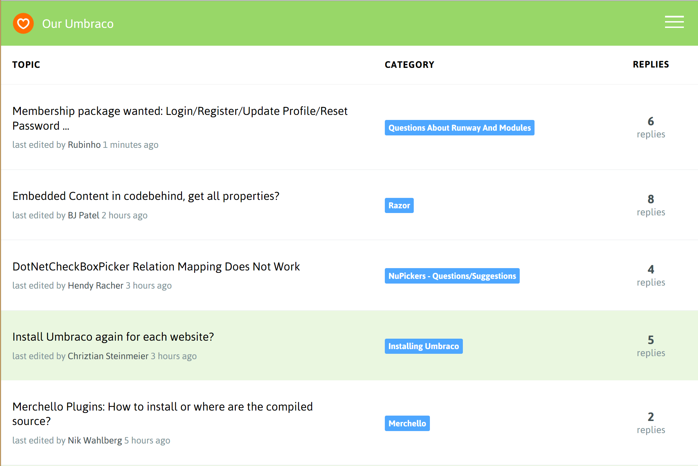
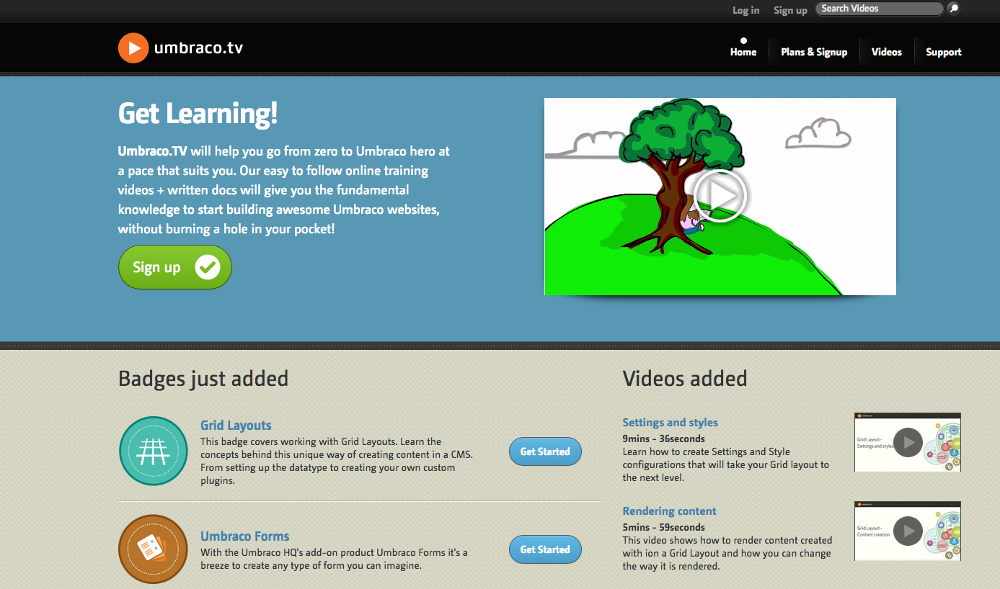
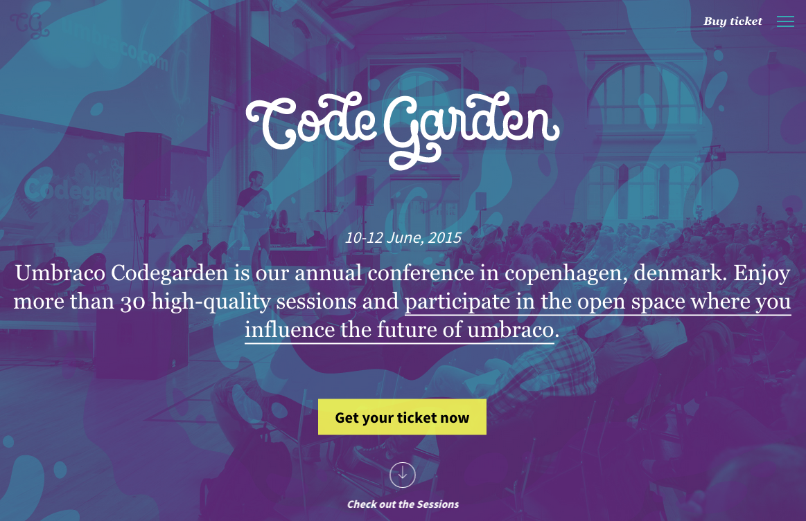
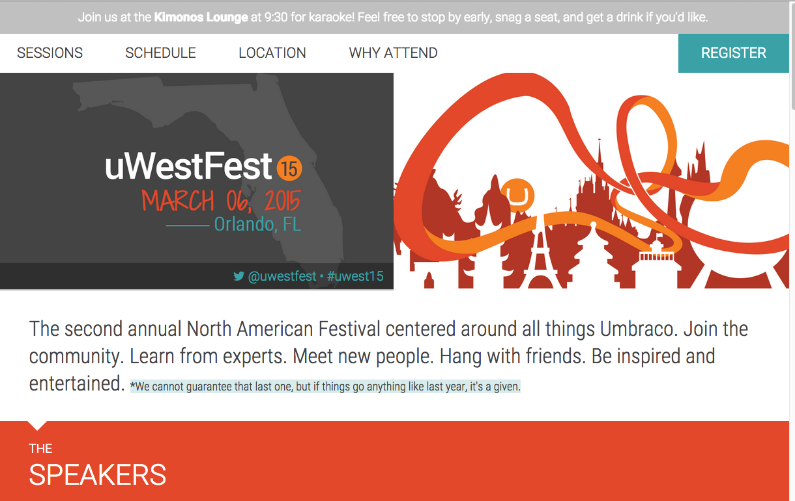
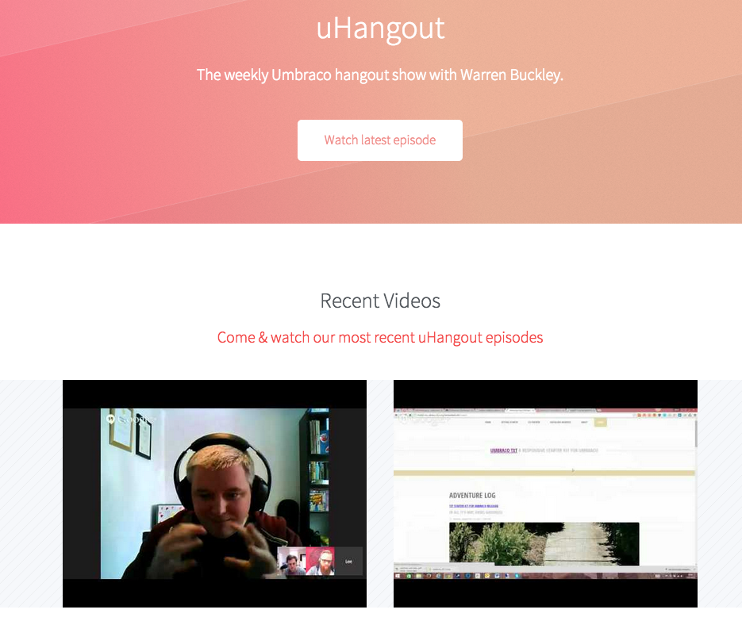

#Umbraco Community#
Umbraco has one of the friendliest communities in the known universe.  The best way to find people talking about current Umbraco topics is via Twitter.  Umbraco is also know for their many meetups and festivals held around the world.  Umbraco developers typically refer to themselves as *Umbracians*.

##Our Umbraco##
The community forums are hosted at http://our.umbraco.org.  You can also find some great packages and official documentation.

##Umbraco.tv##
Videos from the core team can be accessed through a subscription at: http://umbraco.tv/

##Codegarden##
Codegarden is the main festival that occurs every year in the late Spring.  It usually is hosted in Copenhagen Denmark and attracts around 400 Umbracians every year.  http://codegarden15.com

##uWestFest##
uWestFest is relatively new and is the North American festival held in late Winter.  http://www.uwestfest.com/

##UK Fest##
 UK Fest is the United Kingdom festival typically held in the Fall.
##uHangout##
uHangout is a weekly recurring webcast hosted by Warren Buckley.

http://uhangout.co.uk/

##24days.in##

An annual community contributed blog about Umbraco tips and tricks.

http://24days.in/umbraco

To contribute please tweet to: http://twitter.com/greystate