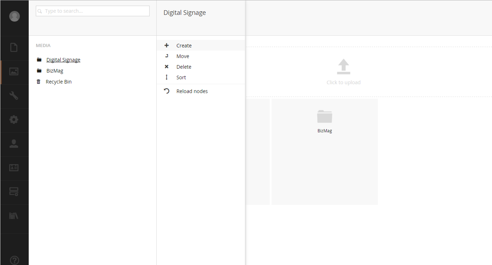

#Media Section#

The media section is where all of the media files will live.  Items dragged and dropped into the `Media Section` will get written to your web root `~/media` folder.  During the import process, image thumbnails are generated and they get assigned a unique folder to avoid accidental overwrites.

The media section works very similar to the content section with limited context menu options.  Out of the box the media section ships with three media types:

* Image - Image files
* Folder - The media type to organize all your other types
* File - PDF's, spreadsheets, etc

From the context menu you can do the following:

* Create - Create a folder, file or image manually.  You can just drop in files as well
* Move - Move to a different folder
* Delete - Remove from the media section - this does not remove files from the file system
* Sort - Sort media items in a folder
* Reload Nodes - Refresh the tree

You can create new media types by visiting the `Settings Section > Media Types`.

There are some reserved property names on media items that you should be aware of:

* `umbracoFile` - The path to the file
* `umbracoWidth` - The image width
* `umbracoHeight` - The image height
* `umbracoBytes` - The file size in bytes
* `umbracoExtension` - The file extension

It is very common to change the type of the `umbracoFile` property to `Image Cropper` which is the built-in focus-oriented cropping property.

Umbraco also is compatible with using virtual directories and custom file providers to locate your media in a different directory or even on a cloud server.

>IMPORTANT: All media files are open to the public.  To make any media files private, you will have to implement a custom or use a 3rd party package.

[<Back 01 - Content Section](01 - Content Section.md)

[Next> 03 - Settings Section](03 - Settings Section.md)