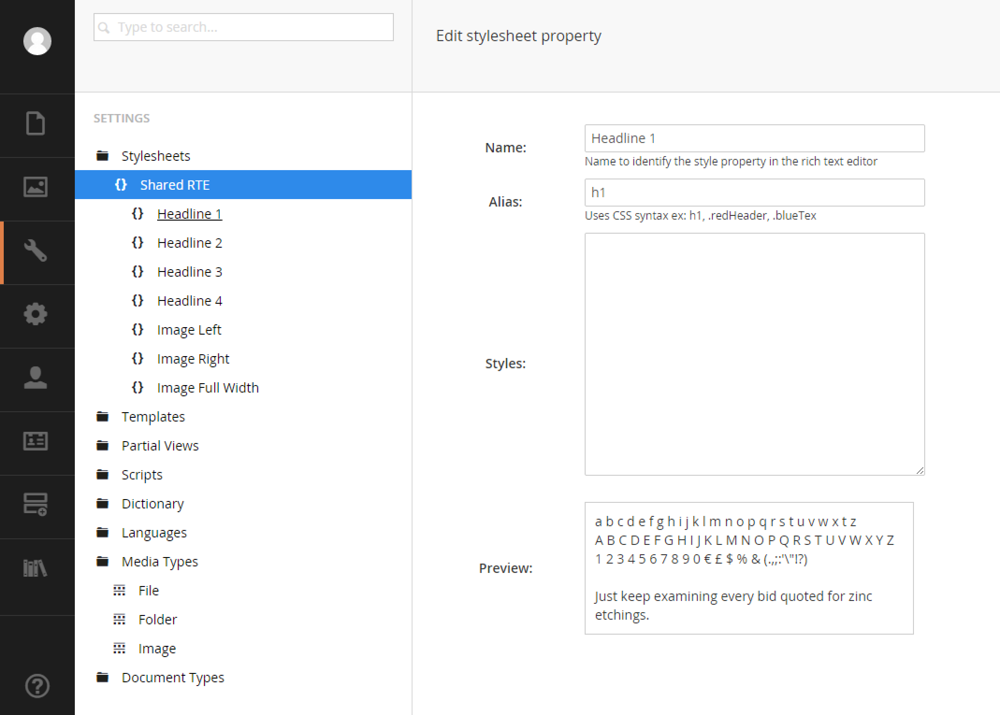
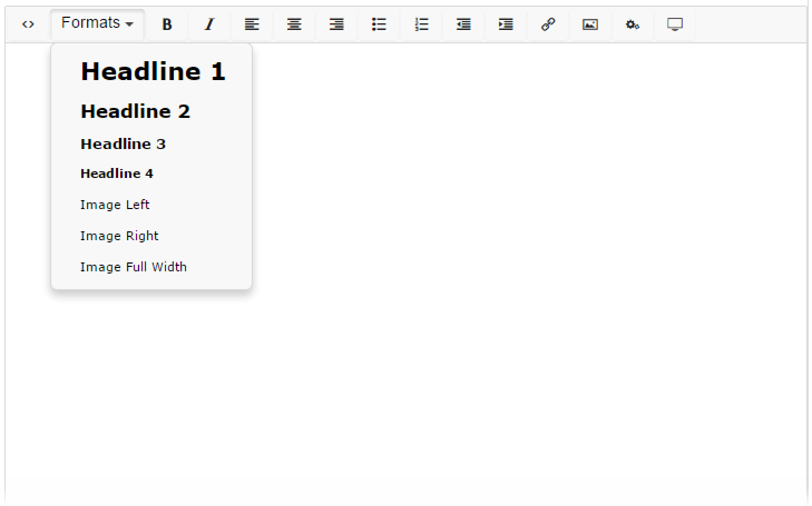
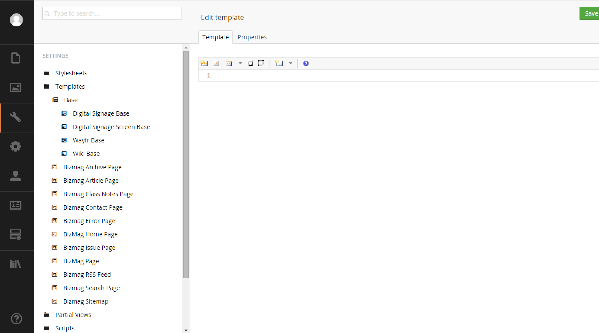
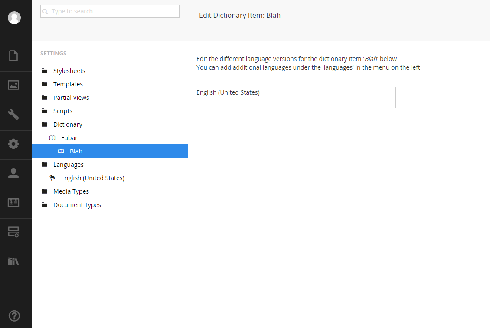

# Settings Section

The settings section is similar to the content and media trees except this section is usually hidden from editors.  You can configure and edit a lot of Umbraco items.

If a video is more your style, here's the Settings Section in detail: https://www.youtube.com/watch?v=EopnnkIaiRI

## Stylesheets

This section is used to define styles that can be linked to a rich text editor (in the Developer>Datatypes section).

By defining some rules here, your RTE's can have different drop options in the `Format` menu item.

To enable the style sheet for a particular RTE, visit the RTE in the `Developer->Data Types` section and tick the box for your stylesheet:

## Templates

Use the templates tree to register a template with Umbraco.  You can also use the built-in editor.  When you create a template, a `.cshtml` file will be created in your web root at `~/views`.

## Partial Views

This lists the file system `~/views/Partial Views` directory.  It is not necessary to register partials with Umbraco.

## Dictionary

Register dictionary terms here for each language that you have configured (the next section).

## Languages

Tell Umbraco about the locales you are using.  Among other things, these languages are used for dictionary items.

## Media Types

As discussed in the [media section](02%20-%20Media%20Section.md), this is where you'll configure your different types of media.  Typically you won't need to change anything here.  Sometimes the `Image` is modified to allow for different inputs such as an `alt` tag value or meta keywords for search results.

## Document Types

This is one of the most important spots in Umbraco.  This section is where you'll define Umbraco content types.

>NOTE: The terms `Document Type` and `Content Type` are used interchangeably at times.

Document types are the logical units that content is derived from.  A document type is where a developer would do the following:

* Add data types that are presented to an editor
* Create tabs to organize data types
* Assign one or more templates
* Inherit other document type properties
* Choose an icon to be shown in the tree
* Enable or disable a list view
* Determine what child document types may exist under this type in the content tree

>NOTE: The terms `Data Type` and `Property Editor` are used interchangeably.  Data types are the inputs editors will be keying data into.
The success of an Umbraco install can be greatly influenced by how the document types, data types and templates are architected.  A whole [chapter](/Chapter%2003%20-%20Document%20Types,%20Templates%20and%20Data%20Types) is dedicated to this concept.

[<Back 02 - Media Section](02%20-%20Media%20Section.md)

[Next> 04 - Developer Section](04%20-%20Developer%20Section.md)
