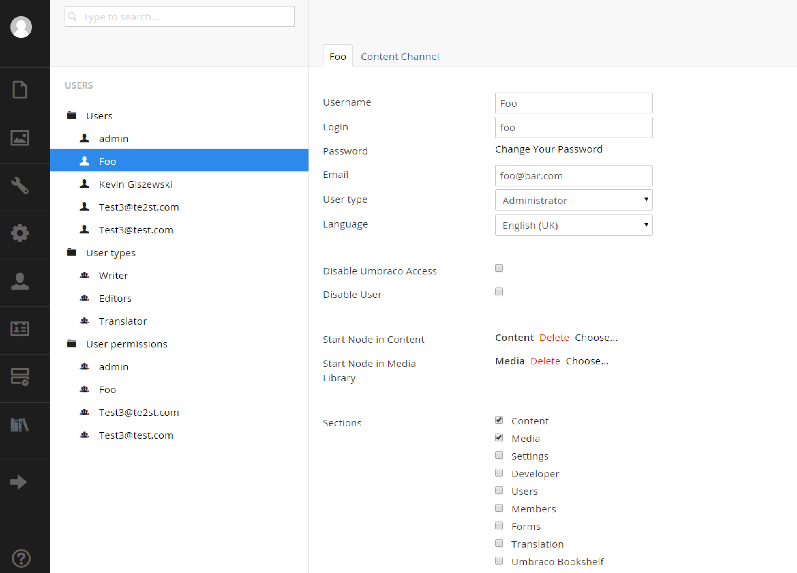

# Users Section

The users section is where you'll manage users who are meant to log into the Umbraco backoffice.  These are different types of users from `members` which are persons who login to the frontend.

Beginning with Umbraco 7.7.x, the User's section is completely different take a tour here: https://www.youtube.com/watch?v=KUrhw_Ad2kw

## User Management

Add, modify or disable users by selecting `Users` in the tree.  Note that you cannot delete users due to audit trail reasons.

Each user will need at a minimum:

* Username
* Login
* Content Start Node
* Media Start Node
* Sections

This screen determines which sections are available to users.  Most non-admins will only need access to `Content` and `Media`.

## User Types
Here you can setup default context menu load outs that can then be selected in the `Users` screen per user.

## User Permissions
Restrict access on a per node/user basis.

[<Back 04 - Developer Section](04%20-%20Developer%20Section.md)

[Next> 06 - Members Section](06%20-%20Members%20Section.md)
