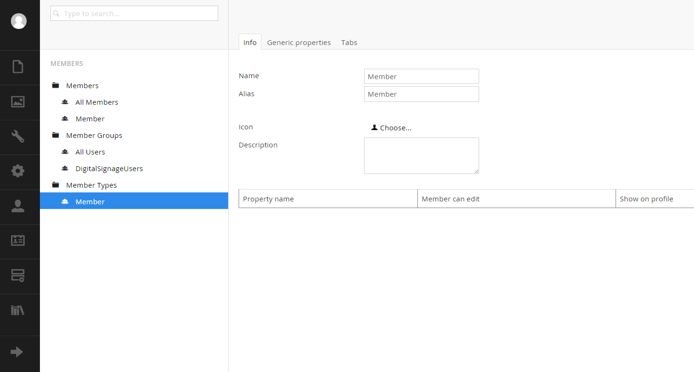

#Members Section#

Members are users who will be visiting the frontend of your website and need to pass through a login.  Members can be assigned to groups and have custom properties set.  It important to distinguish between `Users` and `Members`.  `Users` are backoffice users.  For more information on those types, please consult the previous section.

##Member Management##
The first tree node is where you want to be to manage users.  In this section you can set usernames, group (role) membership and more.

##Member Groups##
Member groups are special roles that you can create and assign to members.

[<Back 05 - Users Section](05 - Users Section.md)

[Next> 07 - Forms Section](07 - Forms Section.md)