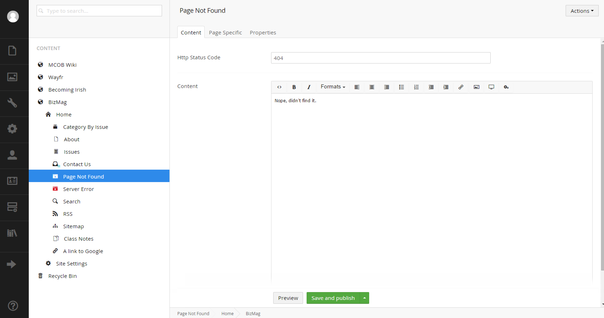

#Custom Error Setup#
The plan here is to avoid the dreaded YSOD for 500 errors and the default 404 screen that IIS or Umbraco will serve up.  This method will make use of naming your error pages using a convention (that you can choose) so that your error pages should work on any environment.  We'll even touch on a way to handle redirects for your site.

##The Web.Config##
A few things need to be fiddled with here.  First let's turn on custom errors.  You can set this value on your normal `Web.Config` file or better yet, set up a transform that on turns on custom errors in a production environment.

The edits we make should cover IIS6+, so there is some settings redundancy that is required.

Find your `<system.webServer>` section and add this:

```
    <httpErrors errorMode="Custom">
      <remove statusCode="404" subStatusCode="-1" />
      <error statusCode="404" prefixLanguageFilePath="" path="/page-not-found/" responseMode="ExecuteURL" />
      <remove statusCode="500" subStatusCode="-1" />
      <error statusCode="500" prefixLanguageFilePath="" path="/server-error/" responseMode="ExecuteURL" />
    </httpErrors>
```

Now find your `<system.web>` section and update it to this:
```
    <customErrors mode="On" defaultRedirect="/server-error/">
      <error statusCode="404" redirect="/page-not-found/" />
      <error statusCode="500" redirect="/server-error/" />
    </customErrors>
```

Let's pause a second and digest what we added:

* The first block tells the web app to handle both 404 and 500 responses by redirecting to the paths listed.  This block handles newer versions of IIS.
* The second block is similar to the first except the `mode` attribute handles whether errors are turned on or not.  This attribute needs to be set to `On` in production (and for testing).  If you use a web transform, the transform entry would look like this:

```
    <customErrors mode="On" xdt:Transform="SetAttributes(mode)">
    </customErrors>
```
>If you are unfamiliar with transforms, it's definitely worth a Google as it's standard .NET web app material.

So now that we've told the web app to go to specific URL's when a 404 and a 500 happen, we then need to create those in our content tree.  When you create those it's probably best to create their own document type such as `ErrorPage` or whatever.  Add whatever you want to your document types such as a rich text editor for a message to be displayed by your template.

From a multi-site setup standpoint, each of your sites will then have to have an error page named `Server Error` and `Page Not Found`.



##Proper Status Code##
So one side effect of doing your custom errors this way is the response code from your web app will be `200 OK` which is not acceptable.  One way around this is to specifically set your HTTP status code on the template (or hijack the controller).

The code to set the status is below:
```
 HttpContext.Current.Response.StatusCode = 404;
```

##Redirects##
Now that we have a way to capture 404's (and 500's), a positive side-effect is that we now have a extension point for redirects.  The idea is if Umbraco was normally going to issue a 404, we can preempt it and run through a lists of known redirects.  If after we run through our list of redirects, we don't find a match, we can let the 404 happen.

A side project that handles this sort of redirection help can be found here: https://github.com/kgiszewski/G42.UmbracoGrease

If you need 100's of redirects, you may want to use an Umbraco package built for such a purpose.

[<Back Overview](README.md)