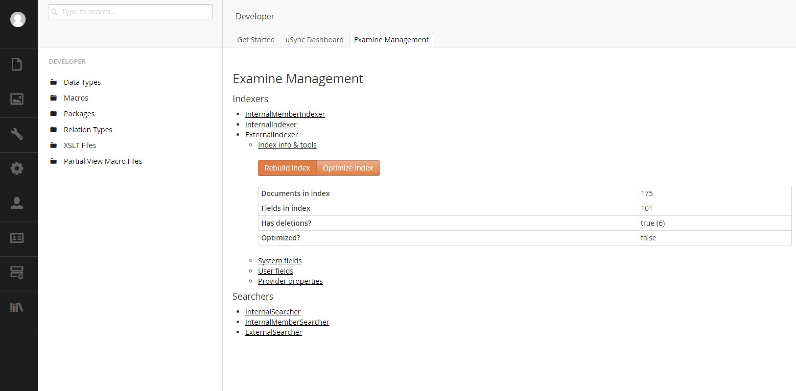
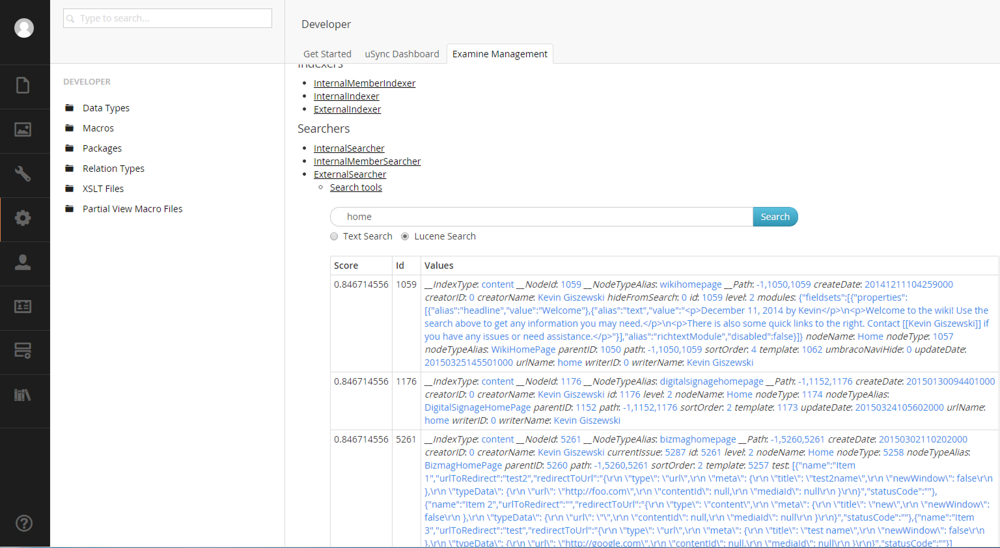
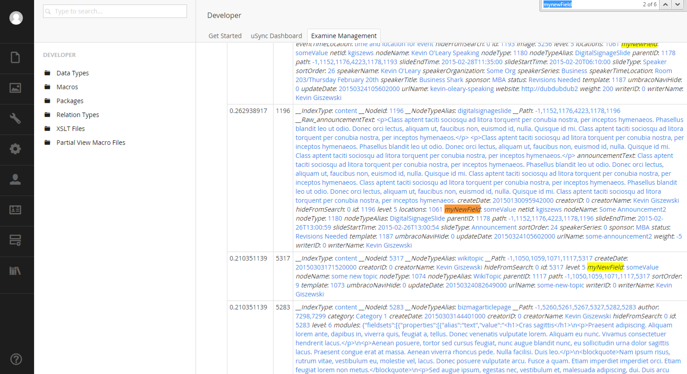
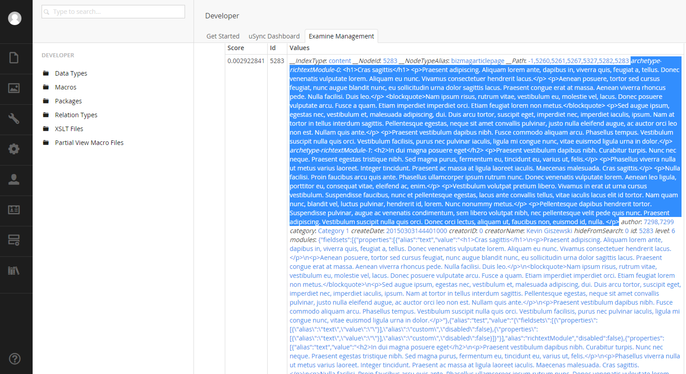

#Built-in Functionality#
Examine has three indexers built-in to Umbraco.  What are indexers?  Indexers are sets of searchable indexes that will return different types of results.  The three built-in indexers are:

* `InternalIndexer` - Used to power the backoffice search (top left).
* `InternalMemberIndexer` - Used to search members.
* `ExternalIndexer` - Used to index your content for public use.  This indexer excludes password protected content and unpublished pages (whereas the `InternalIndexer` includes them)

Configuration for the Examine (including the indexers) can be found on your system in two files:

* `~/config/ExamineSettings.config`
* `~/config/ExamineIndex.config`

For the most part you will only be using the `ExternalSearcher` because you will most likely just be dealing with published content.  In fact, by default Examine will index all fields of all document types and add several fields to identify things like the Umbraco node Id.

In case you need to add another index, you'll need to consult the Umbraco documentation.

The index is built on application start up if the index directories are empty (per index).  The index directories are located at: `~/App_Data/TEMP/ExamineIndexes`.  You can force a re-indexing by deleting one or all of the subfolders in that directory.  The index will rebuild next time when it starts up (so touch the web.config).

The better way to force a rebuilding of the index is to use the Examine dashboard which is located in the Umbraco backoffice on the `Developer` dashboard.

##Examine Dashboard##
The examine dashboard is a web GUI that allows you to rebuild the index for a particular indexer and it also provides a test searcher for each index:



When testing with the Examine search tool, you can see the fields that Examine is able to see in the Lucene index files:



##Updating the Indexes##
Whenever a node is saved and published, the index files are automatically updated.  If you need to do some direct index manipulation, there are a few events that you can use to hook into the pipeline.  The most used event is probably `GatheringNodeData` and can be implemented like so:

```c#
using Examine;
using Umbraco.Core;

namespace MyNamespace
{
    public class ExamineStuff : ApplicationEventHandler
    {
        protected override void ApplicationStarted(UmbracoApplicationBase umbracoApplication, ApplicationContext applicationContext)
        {
            base.ApplicationStarted(umbracoApplication, applicationContext);

            ExamineManager.Instance.IndexProviderCollection["ExternalIndexer"].GatheringNodeData += MyGatheringNodeDataMethod;
        }

        private void MyGatheringNodeDataMethod(object sender, IndexingNodeDataEventArgs nodeData)
        {
            nodeData.Fields.Add("myNewField", "someValue");
        }
    }
}
```

After the index is rebuilt or the node is save/published, you can return to the search tool and see that the field is now in the index:



##Complex Property Values##
Sometimes the property contains complex data and might need to be deserialized into individual fields or munged into one large field.  The example below uses Archetype and creates a field per fieldset:

```C#
using System;
using Archetype.Models;
using Examine;
using Newtonsoft.Json;
using Umbraco.Core;
using Umbraco.Core.Logging;

namespace MyNamespace
{
    public class ExamineStuff : ApplicationEventHandler
    {
        protected override void ApplicationStarted(UmbracoApplicationBase umbracoApplication, ApplicationContext applicationContext)
        {
            base.ApplicationStarted(umbracoApplication, applicationContext);

            ExamineManager.Instance.IndexProviderCollection["ExternalIndexer"].GatheringNodeData += MyGatheringNodeDataMethod;
        }

        private void MyGatheringNodeDataMethod(object sender, IndexingNodeDataEventArgs nodeData)
        {
            try
            {
                var docTypeAliasField = nodeData.Fields["nodeTypeAlias"];

                if (docTypeAliasField == "BizmagArticlePage")
                {
                    //modules is the name of the property alias for the archetype
                    if (nodeData.Fields.ContainsKey("modules"))
                    {
                        var archetypeValueAsString = nodeData.Fields["modules"];

                        if (!string.IsNullOrEmpty(archetypeValueAsString))
                        {
                            var archetype = JsonConvert.DeserializeObject<ArchetypeModel>(archetypeValueAsString);

                            var index = 0;

                            foreach (var fieldset in archetype)
                            {
                                var value = fieldset.GetValue<string>("text");

                                if (value != null)
                                {
                                    nodeData.Fields.Add(string.Format("archetype-{0}-{1}", fieldset.Alias, index), value);
                                    index++;
                                }
                            }
                        }
                    }
                }
            }
            catch (Exception ex)
            {
                LogHelper.Error<Exception>(ex.Message, ex);
            }
        }
    }
}
```

And when you return to the search tool, you'll now see the new fields each representing an Archetype fieldset:



[<Back Overview](README.md)

[Next> 02 - Search Results](02 - Search Results.md)