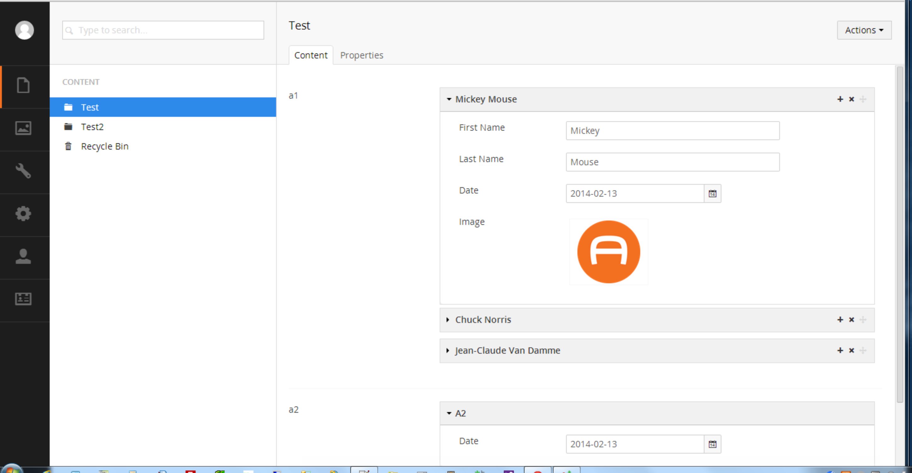

#Archetype#
##By Kevin Giszewski, Tom Fulton, Matt Brailsford, Lee Kelleher, Ken Jacobsen, et. al.##

###What is it?###
Archetype is a way to build short lists of data dynamically at run-time.



A sample of getting the data out and onto templates looks like so:

```c#
@foreach(var item in Model.Content.GetPropertyValue<ArchetypeModel>("someArchetypePropertyAlias"))
{
    <div>@item.GetValue<string>("someArchetypeFieldAlias")</div>
}
```

###Why should I use it?###
It is an alternative to the MNTP pattern for trivial data such as carousel slides, etc.

###Where do I get it?###

**NuGet:** http://www.nuget.org/packages/archetype

**Our Umbraco:** https://our.umbraco.org/projects/backoffice-extensions/archetype

[<Back 02 - uSync](02 - uSync.md)

[Next> 04 - Merchello](04 - Merchello.md)