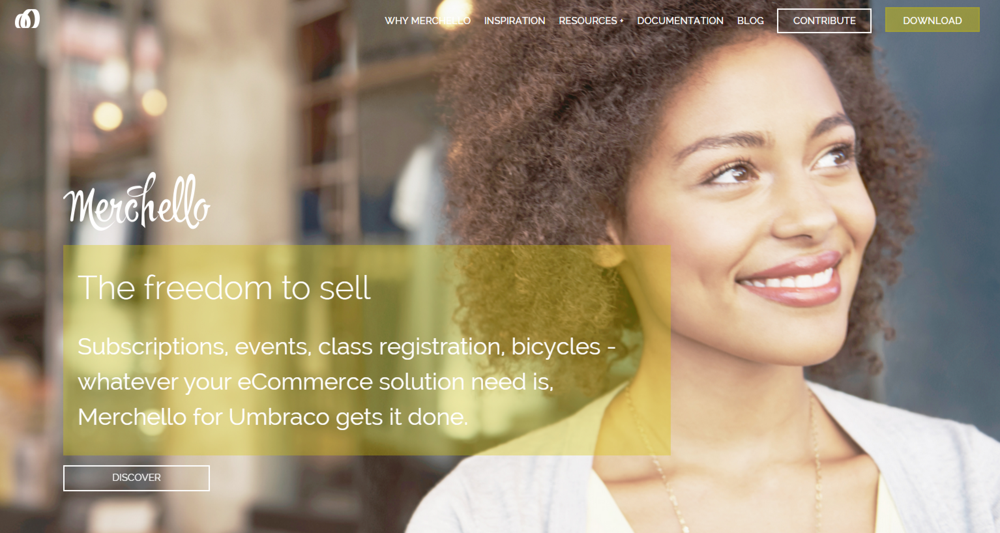

#Merchello#
##By Rusty Swayne, Jason Prothero, et. al.##

###What is it?###
According to the package documentation: "Merchello is a high performance, designer friendly, open source Umbraco ecommerce package built for the store owner."

###Why should I use it?###
It's a free OSS way to get ecommerce into the hands of small business owners.

###Where do I get it?###

**NuGet:** http://www.nuget.org/packages/Merchello.Core/1.0.1.4

**Our Umbraco:**  https://our.umbraco.org/projects/collaboration/merchello

[<Back 03 - Archetype](03 - Archetype.md)

[Next> 05 - Courier](05 - Courier.md)