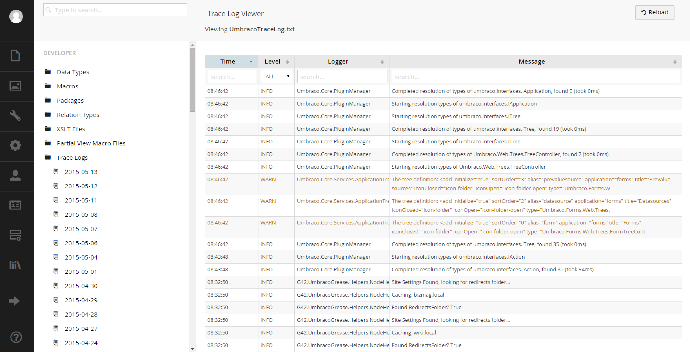

#Diplo Trace Log Viewer#
##Dan Diplo##

###What is it?###
This package creates a tree for all of the `~/App_Data/Logs` files so that you access the log without connecting to the server and downloading them. 

###Why should I use it?###
It's extremely useful for production boxes where access to the box may not be easily accomplished.  It's color-coded and searchable.

###Where do I get it?###

**Our Umbraco:** https://our.umbraco.org/projects/developer-tools/diplo-trace-log-viewer

**NuGet:** http://www.nuget.org/packages/DiploTraceLogViewer/

[<Back 05 - Courier](05 - Courier.md)