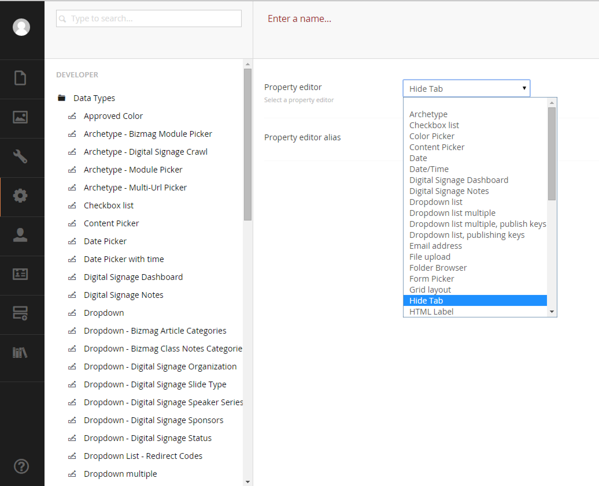

#The View and Directive#
So Angular can seem weird at first, but we're just adding new functionality to HTML.

##The View##
Next we will define a view or what will show on the document type when this property editor is rendered.

So create a file named `~/App_Plugins/HideTab/hideTab.view.html` and place the following line in it:

```
<hide-tab></hide-tab>
```

It's very short and the directive below will make the `<hide-tab>` tag actually do something.

##The Directive##

Next let's create a file called `~/App_Plugins/HideTab/hideTab.directive.js` and place this code in it:

```
angular.module('umbraco.directives').directive('hideTab', function($timeout) {
    var linker = function (scope, element, attrs) {

        $timeout(function() {
            hideTab(element);
        }, 10);
    }

    function hideTab(element) {

        var $umbPanel = element.closest('.umb-panel');

        var $tabs = $umbPanel.find(".umb-nav-tabs li");

        var $thisPane = element.closest('.umb-tab-pane');

        if ($tabs.length > 1) {

            $thisPane.hide();
        }
        else {
            var $properties = $thisPane.find(".umb-control-group");
            $properties.hide();
        }
        var tab = $tabs.find("a[href=#" + $thisPane.attr('id') + "]");

        tab.hide();

    }

    return {
        restrict: "E",
        link: linker
    }
});
```

If we save all the files and restart Umbraco, we should now have a new property to choose from in the `Developer->Data Types` section.



##Recap##
So that was a lot of things happening without much explanation so let's recap where we're at:

* The `package.manifest` registered a view, some JS and some CSS with Umbraco.
* Inside our view we *invented* a tag called `hide-tab`.
* Inside our directive we *defined* what our tag does.

A directive typically just wraps jQuery in AngularJs boilerplate code.  Just remember to never use jQuery in anything other than a directive (not in a controller for instance).

There are four main modules that Umbraco uses internally:

* angular.module('umbraco') - Controllers
* angular.module('umbraco.directives') - Directives
* angular.module('umbraco.services') - Services
* angular.module('umbraco.resources') - Resources

When registering functionality with Umbraco, please use the appropriate module.

If you examine the directive code, the directive simply crawls the DOM and hides items based on what it finds.

We'll cover another property editor later on.

[<Back 01 - Manifest](01 - Manifest.md)

[Next> 03 - AngularJs Umbraco Services and Resources](03 - AngularJs Umbraco Services and Resources.md)