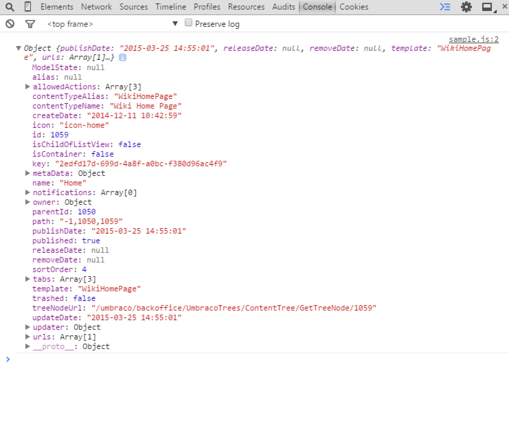
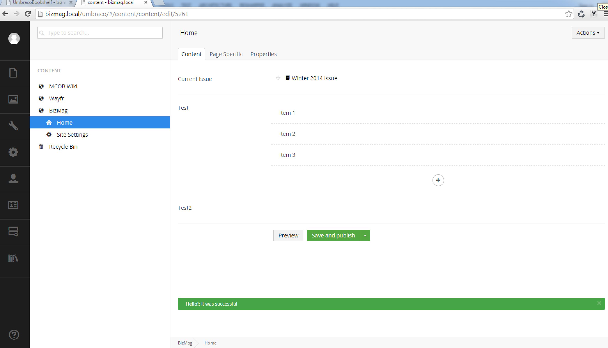
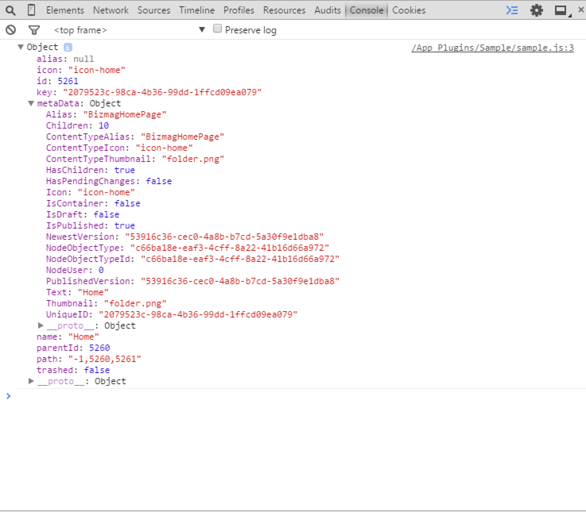

#Umbraco AngularJs Services and Resources#

Umbraco has a great API for working with things on the server in C#.  Umbraco also has a great set of resources and services that you can call from Angular that calls the server side API by proxy.

A full is of these services and resources can be found here: http://umbraco.github.io/Belle/#/api

The following highlights a few of the services and resources you will likely want to use.

#Services#
As a quick example of using the `editorState` service.  Let's register a controller and a view:

```
//manifest
{
  "propertyEditors": [
    {
      "name": "Sample",
      "alias": "Sample",
      "editor": {
        "valueType": "JSON",
        "view": "~/App_Plugins/Sample/sample.html"
      },
      "prevalues": {
        
        
      }
    }
  ],
  "css": [
   
  ],
  "javascript": [
    "~/App_Plugins/Sample/sample.js"
  ]
}


```

```
//controller
angular.module('umbraco').controller('MySampleController', function ($scope, editorState) {
    console.log(editorState.current);
});
```

```
<!-- view -->
<div ng-controller="MySampleController">

</div>
```

If our new property editor is added to a document type and then subsequently visited in the backoffice, we'd see in the console the following:



The example above shows a few things:

* You need to register a controller and a view similar to a directive
* You need to inject a service into your controller
* You can then do something with that service

##NofiticationsService##
Building on the last example, we can use the `NotificationsService` instead:

```
angular.module('umbraco').controller('MySampleController', function ($scope, notificationsService) {
    notificationsService.success("Hello!", "It was successful");
});
```

Which will then show up like the image below:



The idea is you can combine the different services that Umbraco offers into some really awesome plugins.

##Resources##
Resources work very similar to services except resources tend to return lists of things from the backoffice.  The following example gets a single item from Umbraco using the `entityResource`.  This example builds on the previous:

```
angular.module('umbraco').controller('MySampleController', function ($scope, entityResource) {
    entityResource.getById(5261, "Document").then(function (data) {
        console.log(data);
    });
});
```



Notice a few things here:
* The call to `getById()` will return a promise and if successful it'll fill the `data` variable with the JSON from the server.
* This is a very common pattern in AngularJs, please read up on promises and understand that this will happen asynchronously.

[<Back 02 - The View and Directive](02 - The View and Directive.md)

[Next> 04 - URL Picker Property Editor](04 - URL Picker Property Editor.md)