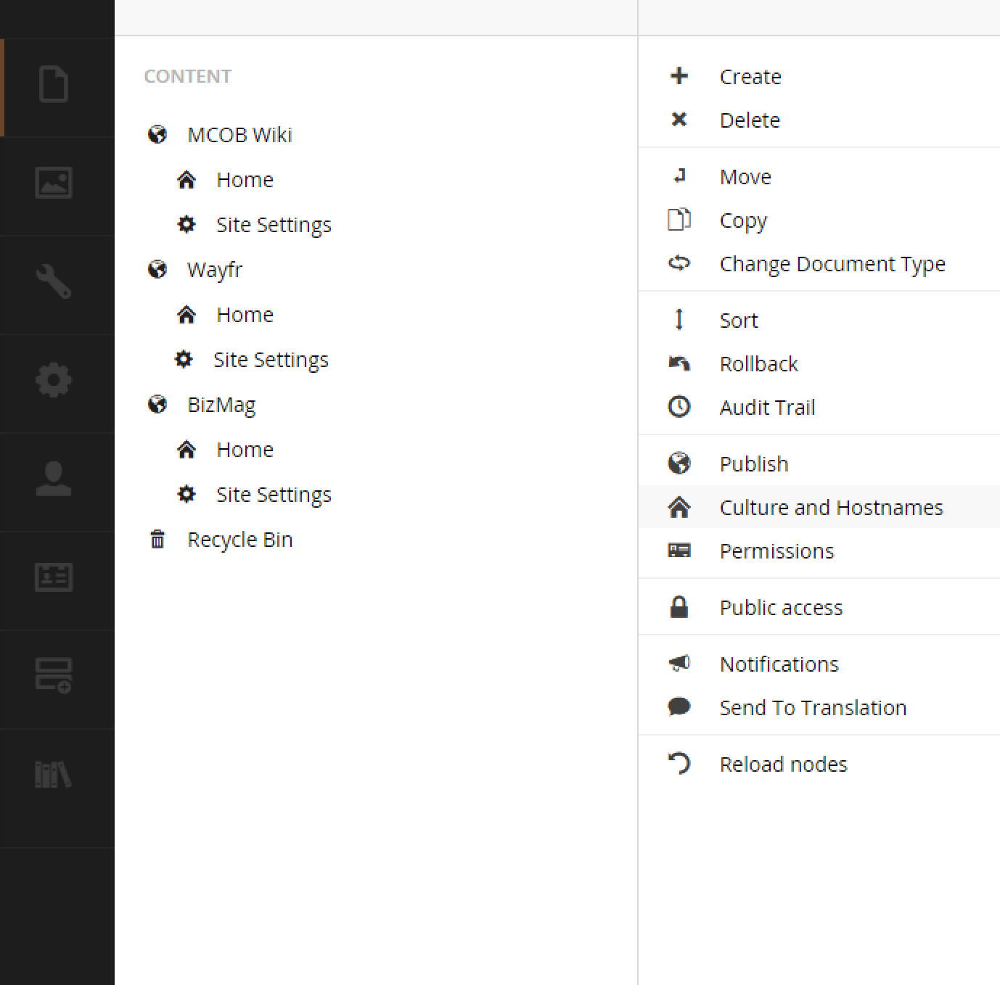

#Domain Setup#
Assign a domain by right clicking on the node that will be the point of entry to your site.  Typically this will be the home page.  By assigning a domain name right to a node, the node's domain will simply be `/`.

>Tip: If you need to delete a node that has a domain assigned, be sure to remove the domain before deleting it.

The standard Umbraco way to do multilingual sites is to assign a culture to the domain and adding several domains to the same `Home` node like so:

* en.foo.com
* fr.foo.com
* dk.foo.com

Visit the `Settings->Languages` section to add new cultures that will be selectable in the domain setup dialog.

[<Back Overview](README.md)