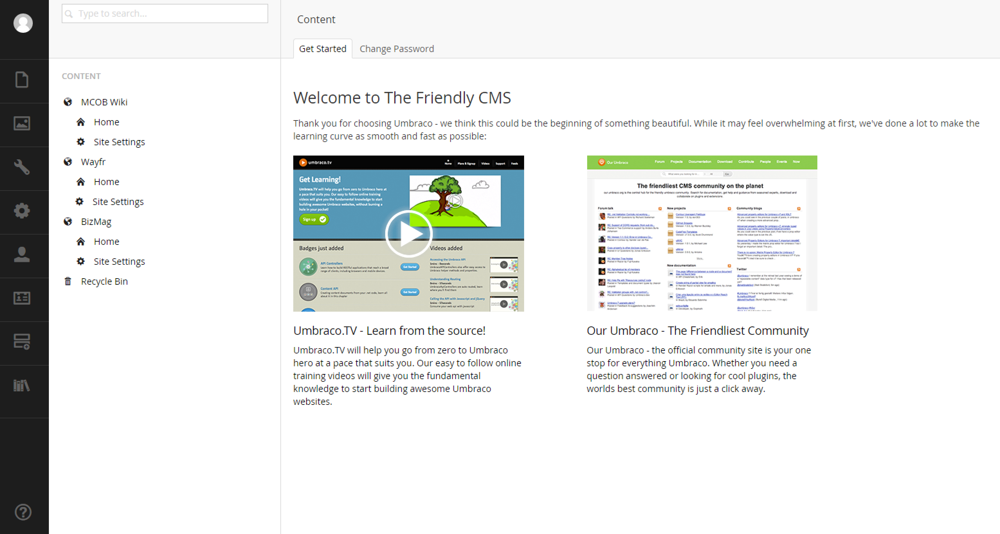

#Overview#

>Photo by Doug Robar

Setting up Umbraco to handle more than one website is easy to do.  Below is a list of things to consider when setting up a multisite install:

* Create a `Site` document type (or whatever you name it) that will reside on root of your content section for each of your sites.
* Use relative paths when using data types such as the multinode tree picker.
* Create a `Home` page under your `Site` node and all pages as children under the `Home` node.
* Assign a domain to each `Home` node.
* Consider creating a `Site Settings` document type to hold settings for each website.

[Next> 01 - Domain Setup](01 - Domain Setup.md)