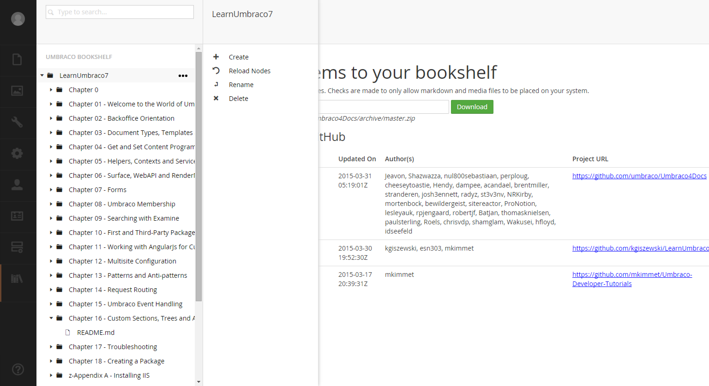

#Custom Sections, Trees and Actions#

>Photo by Doug Robar

What makes Umbraco truly special is the ability to integrate custom functionality without making it look like the extra functionality was tacked on.

This section is dedicated to adding custom sections (also known as applications), trees and actions (context menu items).

This section is based on a good set of blogs by [Markus Johansson](http://www.enkelmedia.se/blogg/2013/11/22/creating-custom-sections-in-umbraco-7-part-1.aspx).  Be sure to visit his blogs for more information.

For our example, we will use the [Umbraco Bookshelf project](https://github.com/kgiszewski/UmbracoBookshelf) for our examples.  The bookshelf project creates a custom section (application), with a custom tree, that has a custom dashboard and finally each node in the tree will have custom actions.

The final product will look like this:

[Next> 01 - Create a Section](01 - Create a Section.md)