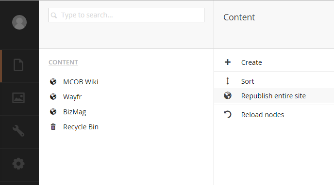

#Troubleshooting#

>Photo by Doug Robar

Inevitably Umbraco will show you love with the ubiquitous yellow screen of death (YSOD).

Some things you may wanna try before googling for answers are below.

##Republish entire site##
This fixes a lot of 'content is missing' between environments or fresh DB deployments.

This is a quick action and can be found by right-clicking on words `Content` and selecting `Republish entire site`.

##Touch the web.config##
Most of you know, but just in case you don't; any modification to the web.config will cause the site to restart.  This is a great way to clean out cached items and get going again.  Simply add and remove a space and save the file.

##Rebuild Your Site##
Often times after a NuGet install or simple `.cs` file update, a developer will forget to build his/her solution.  Rebuilding sometimes fixes missing updates.

##Check the Log##
Most un-handled errors will get logged into text files located at `~/App_Data/logs/`.  This is a good place to start when the usual tricks don't work.

##Recovering a Lost Admin Password##
Your password for your backoffice account is stored in the database inside the `umbracoUserLogins` table.  The password is hashed and you will need to replace your users' hash with a known hashed value.

For example if you replace your password with `LCsQb84eg25PdNLUEk3zW04Cw/E=` your password will be set to `1234`.

##Reporting a Bug##
Before reporting a bug, you may want to pose a question on the forums at http://our.umbraco.org. If indeed you would like to report a bug to the core, register the issue at http://issues.umbraco.org. If you want to makes some friends, try troubleshooting the core and sending a pull-request (PR) to the core team.
