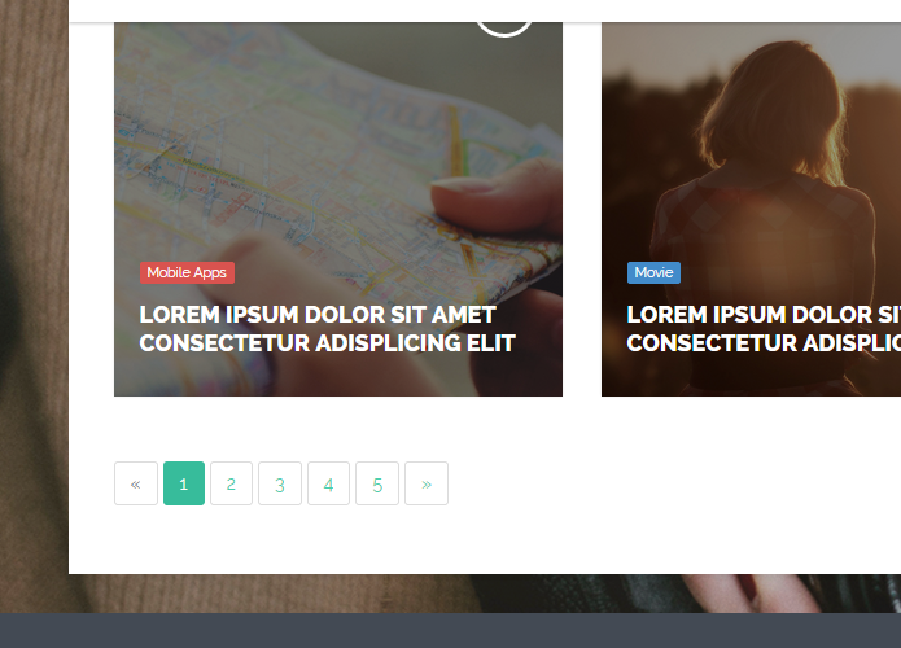

#PagedList#

Very often sites require the need for pagination of content like the image below:



One NuGet package that is very useful to pull this off with very little code is the `PagedList` package: https://github.com/TroyGoode/PagedList

This package makes pagination a breeze and you can customize your URL's however you like.  To pull this off you'll have to do the following:

* Install via NuGet: https://www.nuget.org/packages/PagedList.Mvc
* Add the `.ToPagedList()` method to an `IEnumerable` or `IQueryable` object
* Drop the pager code wherever you need it

Consider the following example:

```c#
@inherits Umbraco.Web.Mvc.UmbracoTemplatePage
@using MyNamespace.UmbracoExtensions.Shared.Searchers;
@using MyNamespace.UmbracoExtensions.Shared.Helpers;
@using PagedList
@using PagedList.Mvc
@{
    Layout = "~/Views/base.cshtml";

    //do some seach logic
    var keywords = HttpContext.Current.Request.QueryString["q"];

    if (string.IsNullOrEmpty(keywords) || string.IsNullOrWhiteSpace(keywords))
    {
        HttpContext.Current.Response.Redirect("/");
    }

    keywords = keywords.Trim();

    var searcher = new MySearcher();
    var results = searcher.Search(keywords).OrderByDescending(x => x.Score);

    //use 'p' query string as the page number
    var pageQueryString = HttpContext.Current.Request.QueryString["p"];

    var pageNumber = 1;

    if (pageQueryString != null)
    {
        pageNumber = Convert.ToInt32(pageQueryString);
    }
    
    //this is the magic here, note the number 10 is amount per page
    var pagedResultList = results.ToPagedList(pageNumber, 10);
}


<div class="container">

    <div class="row">

        <div class="col-lg-12">
            <h3 class="page-header">Your search for <em>"@keywords"</em> returned @results.Count() result(s):</h3>
        </div>
    </div>

    <div class="row">
        <div class="content col-lg-12">
            @if (results.Any())
            {
                <ol>
                    @foreach(item in pagedResultList)
                    {
                        <!-- list your results -->
                        <li></li>
                    }
                </ol>
            }
            else
            {
                <p>There were no results, please try different keywords.</p>
            }

            <!-- begin:pagination -->
            <div class="row">
                <div class="col-md-12 search-pager">

                    <!-- this is the pager, if you drop it on a bootstrap page, it'll style up automatically -->
                    <!-- the 'page' variable is given to you inside your function -->
                    @Html.PagedListPager(pagedResultList, page => ("?q=" + keywords + "&p=" + page))

                </div>
            </div>
            <!-- end:pagination -->
        </div>
    </div>
</div>
```

The pager will have it's URL's in the following format:

* http://foo.local/mypage?q=a%20keyword&p=1
* http://foo.local/mypage?q=a%20keyword&p=2
* http://foo.local/mypage?q=a%20keyword&p=3

[<Back Overview](README.md)

[Next> 02 - Sitemap](02 - Sitemap.md)