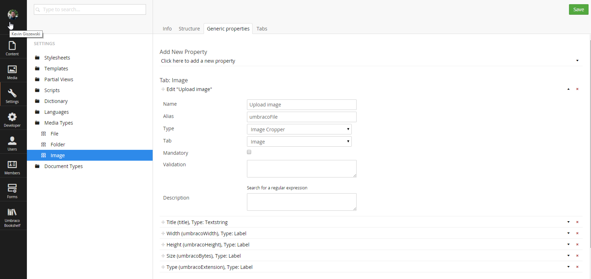
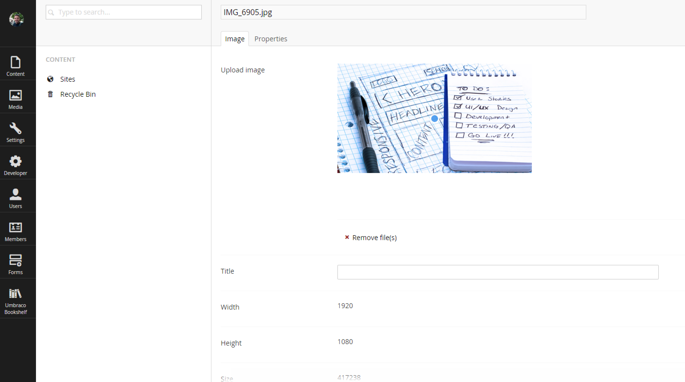

#Image Processor#

[Image Processor](http://imageprocessor.org/) is a third-party product that is included with Umbraco. It was created by [James South](https://twitter.com/james_m_south) and the project is free and open-source on [GitHub](https://github.com/JimBobSquarePants/ImageProcessor/blob/V2/README.md).

##What does it do for Umbraco?##
It is implemented as an ASP.NET HttpModule and intercepts all image requests.  The Umbraco backoffice uses it to provide on-the-fly cached crops of media items.  For instance if you were to view a media item located at: `http://mydomain.local/media/1001/foo.jpg`, the image would show in it's native form as you would expect.

However, if you add some query string parameters like the below example, you would get a crop in return:
```
http://mydomain.local/media/1001/foo.jpg?height=100&width=200
```

Image Processor does this by intercepting the image request and attempting to apply the crop.  What's even better, Image Processor stores the cropped image in the `~/App_Data/` folder for better response for users who come along later.  The good news is it all 'just works' and you don't have to worry about anything else.

>For a complete list of features, please visit the Image Processor site.

##Upgradeable##
Since Image Processor will evolve with new features faster than Umbraco may adopt newer versions, you can even upgrade Image Processor separately to take advantage of bug fixes and features immediately.

##Image Cropper and Template Usage##
One way to get usage out of Image Processor is to switch out the `Media Types` data type for images to `Image Cropper` (shown below):



Now when you go to view an image in the media section, a blue dot (we'll call it the hockey puck) appears.  This dot is used to tell Umbraco where the important part (focal point) is.  You can move it around and leave it on someones face for instance.


>It's hard to see, but it's in the center of the image right now.  We're calling it a hockey puck until we figure out what it's official name is.

Finally, go to your template and tell Umbraco to crop an image based on where the hockey puck is and Image Processor will do the rest:

```
@{
   var imageToCrop = Umbraco.TypedMedia(1234);
}


```

This works great when you need to use an image in landscape for a hero banner and a square image for a thumbnail.  By using this method you can use a single picture for both types of crops.  The hockey puck position decides which part of the image will be used for the crop.

[<Back 04 - Custom Membership Providers](04 - Custom Membership Providers.md)