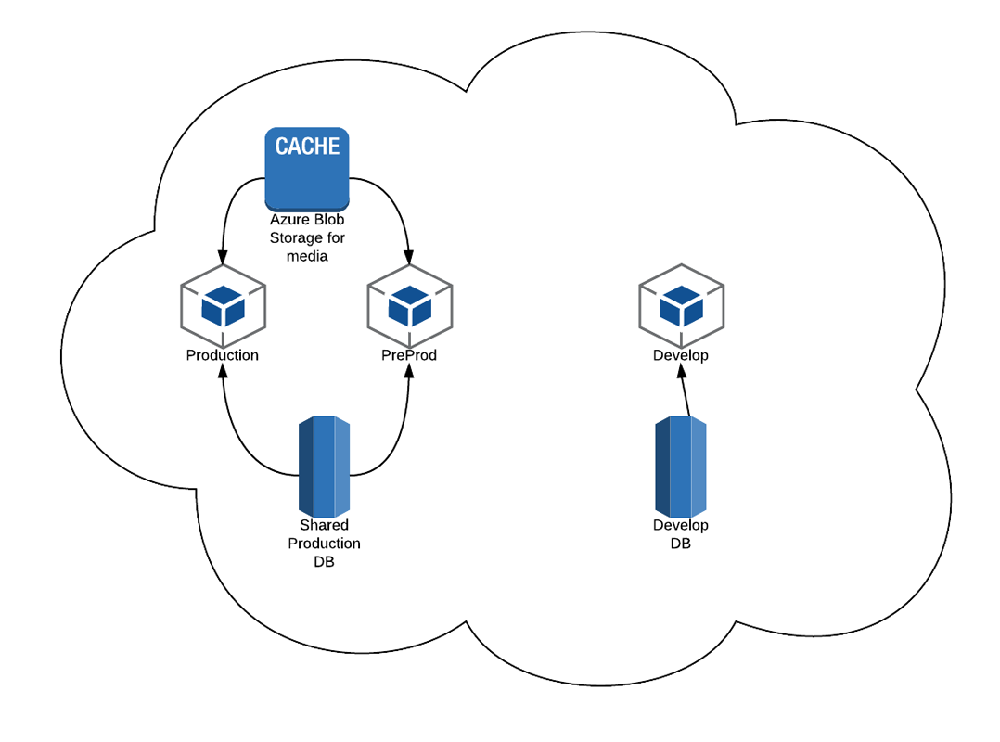

#Slots#

What is an Azure slot?  An Azure slot is essentially a website that is mapped to a URL, a DB, some settings and a code repository.  Functionally speaking, it is very advantageous to be able to push to your `master` branch on GitHub and have it auto deploy to Azure.  But deploying directly from `master` and displaying to the public is somewhat dangerous.  So Microsoft has a feature called `swap`.  It swaps one slot for another.

So as an example, we setup our environment to auto deploy to `preprod` when a push was made to `master`.  This continuous integration speeds up the deployment process greatly.  We then visit our `preprod` slot (that has it's own url) before we make it 'live'.  If after we deploy, we discover a critical issue, we can rollback immediately by hitting 'swap' again.  Of course this is provided you haven't push to `master` in the meantime (as that would have triggered another update of `preprod`.

So when you swap, the website 'references' are swapped.  So what was pointing to your production URL has now been swapped with what was pointing to your preprod URL.  This is important since your `/media` probably will be different (not a good thing).  Your other configs may or may not be swapped, the following was taken from the Azure documentation (http://azure.microsoft.com/en-us/documentation/articles/web-sites-staged-publishing/):

```
Settings that are swapped:

General settings - such as framework version, 32/64-bit, Web sockets
App settings (can be configured to stick to a slot)
Connection strings (can be configured to stick to a slot)
Handler mappings
Monitoring and diagnostic settings
WebJobs content

Settings that are not swapped:

Publishing endpoints
Custom Domain Names
SSL certificates and bindings
Scale settings
WebJobs schedulers
```

##Topology

In order to keep some sort of order and synchronization with your media, you will need to setup your topology as follows:

* Production (not connected to GitHub)
* Preprod (connected to Master branch)
* Production DB (connected to both production and preprod)
* Move media into Azure Blob Storage (connected to both production and preproduction)
* Staging (connected to Develop branch)
* Staging DB connected only to develop slot



The reason for the preprod and production being connected to the same media and DB, this ensures that no resources are lost between swaps.

>You should probably disable auto sync stuff such as uSync.  Perform import operations manaully using those packages instead.


##Repo Sanity Check
You should go out of your way to make sure you're not storing more code than you need to.  To get the most out of Azure, you should be using NuGet packages wherever possible and turn on 'Enable NuGet Package Restore' in Visual Studio.

If you do this properly, you won't actually store any of Umbraco in your repo (or any other NuGet items).  When your repo gets deployed to Azure, all of your NuGet packages will be downloaded from NuGet and deployed with your project automatically.  A lean repo is a clean and tidy repo.  It's a bit magical.  If you're not using the NuGet command `install-package umbracocms` when you install Umbraco, you're doing more work than you should. 

[<Back Overview](README.md)

[Next> 02 - Azure Configuration](02 - Azure Configuration.md)