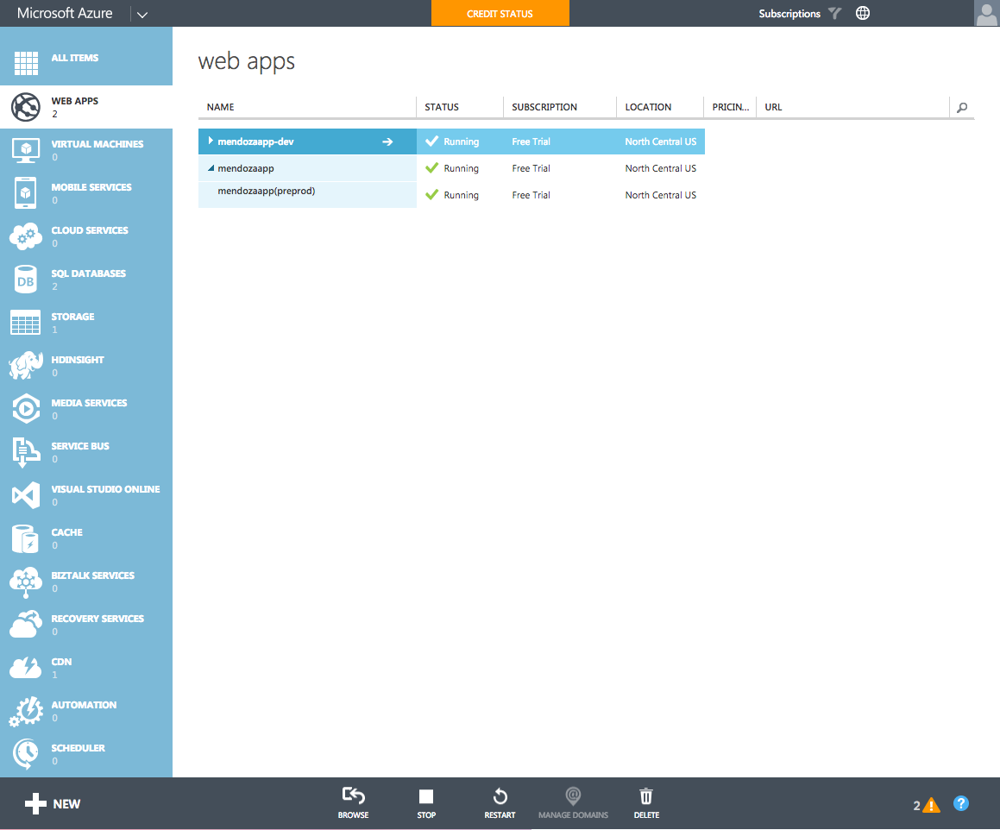

#Overview#

>Photo by Doug Robar

Umbraco is incredibly compatible with Azure, but it takes a strong stomach to be able to fully utilize all of the bells and whistles.  This chapter covers the Azure Websites configuration specifically and will enable you to do the following:

* Run the main site from a production slot
* Pre-stage a release with a pre-production slot (Continuously integrated with a GitHub Master branch)
* Ability to 'swap' between production and pre-production
* A development server (Continuously integrated with a GitHub Developer branch)
* Host your `/media` folder on Azure
* Host your Image Processor cache on Azure
* Have your media served via the Azure CDN
* Perform web.config transformation based on slot

>Note that this is not a tutorial, rather it is more or less a guide as to how set things up overall and some help with configurations.  It is assumed you've been able to setup an Azure Website already but just want to see how to optimize things.

Azure provides a bunch of things that may cut a lot of dev ops costs (i.e. TeamCity).

[Next> 01- Slots](01- Slots.md)