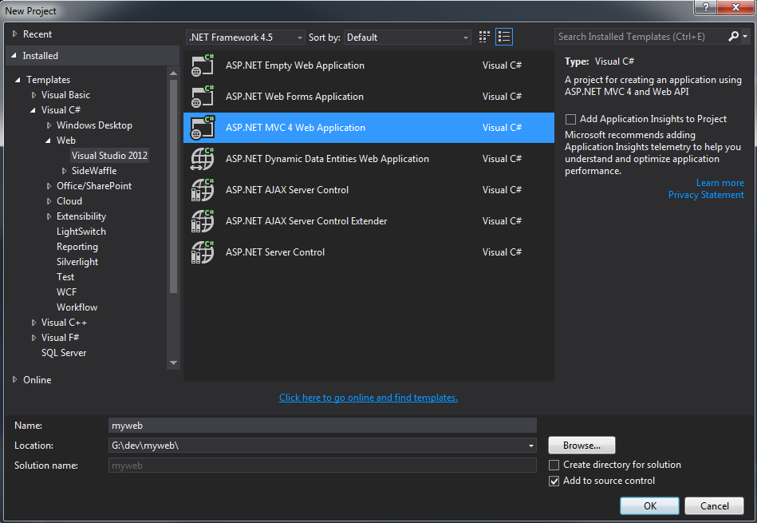
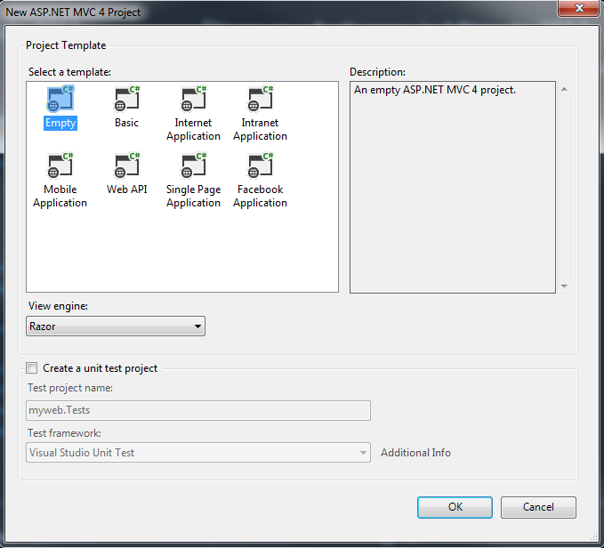
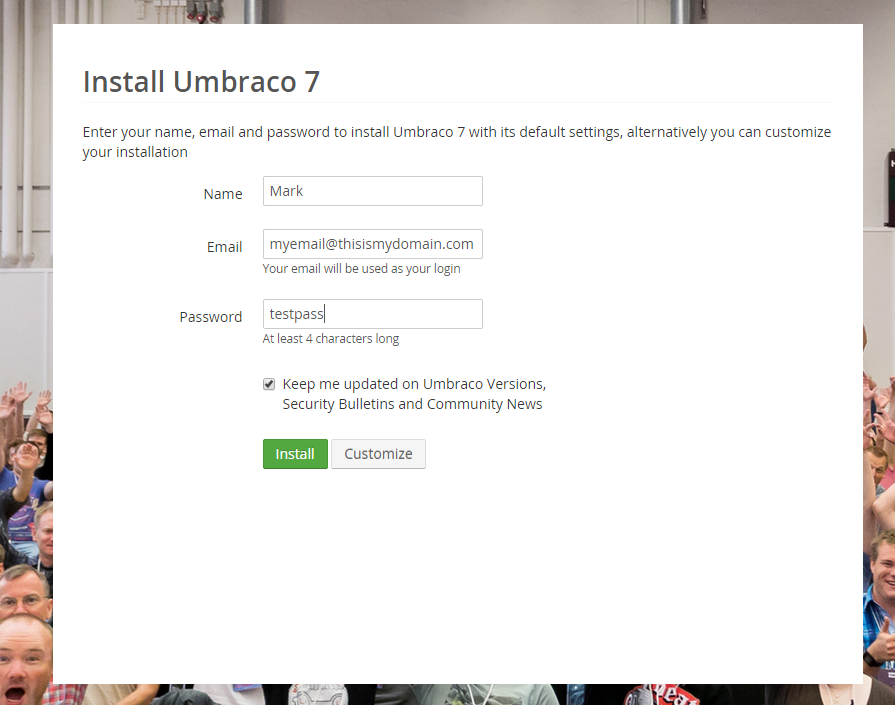
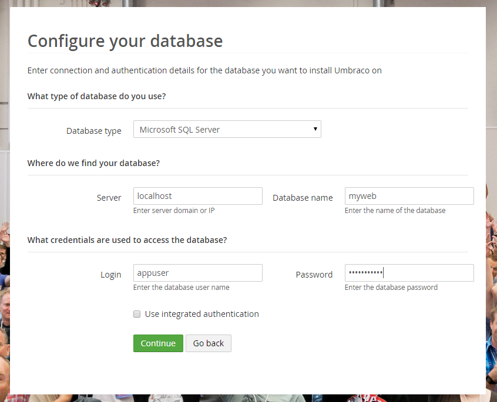

#Installing Umbraco#


>Photo by Doug Robar

If you haven't set up IIS with a website and Visual Studio, see Appendices A and B first.  After you have these set up you can continue on to install Umbraco.

First open up Visual Studio and create a new Project.  Make sure to use .NET Framework 4.5 and select MVC 4 Web Application for
Visual Studio 2012 for your project type.  See the image below for an example of the setting to use.  Feel free to use a different name and location.  You can uncheck the "Create directory for solution" checkbox if you don't want to have two layers of folders.  Also you don’t have to use source control if you don’t want to, we won't be covering that in this appendix.



After you have your settings to your liking click OK.  The screen below will appear.  For Project Template select Empty and click OK.



After it creates the project in the Visual Studio menu select "Tools → Nuget Package Manager → Package
Manager Console" and then run the following command.  During the install it will ask you if you
want to overwrite Global.asx, Enter "A" and click enter to overwrite all files.
```
PM> Install-Package UmbracoCms
```

NOTE: Installing UmbracoCms will also install the Umbraco core.  However, if you get an error about an assembly cannot be loaded twice, you might want to try installing the core manually by running the following command:
PM> Install-Package UmbracoCms.core

Once it completes build the project in Visual Studio: Build-->Build Solution

You will want to double check two things IIS:

*   Visual Studio created a new folder and you will need to point your IIS website to it. Open up IIS and set the path of your website to c:\dev\myweb\myweb (or whatever your path to your website is).    If you don’t do this you will receive a 404 error, cannot list the contents of the directory.
*   Secondly, in IIS make sure your app pool, is set for .NET 4.  If it’s not you will receive an error in the next step saying “Unrecognized attribute ‘targetFramework’

Open a web browser and go to your website, in this example it's http://myweb

Note: The first time you go to the webpage you will need to type http:// otherwise it will most likely redirect you to a google search

At this point you should see the Umbraco Installation screen.  Type in your name, email and password and click the Customize button (if you are going to use the built in SQL CE database you can click on Install rather than custom and it will skip the next step and begin the install).



If you click custom, then you will need to provide the information for your SQL server instance.  If you are running your own SQL server locally,  select Microsoft SQL Server.  Type in localhost for your server and the name of your database, in this example our database is myweb.  In this example we have created a user called appuser with access to the database. 
Then click on Continue.



Most likely you'll want to start with a clean install of Umbraco, so on the next screen click on “No Thanks, I do not want a starter Website” unless you want the default site created for you.

It will take a few minutes to install and then it will redirect you to the back-end Umbraco admin.

Congratulations, you now have Umbraco Installed! You should now be able to log in to the Umbraco using your email and password that you set on the first Umbraco install screen.