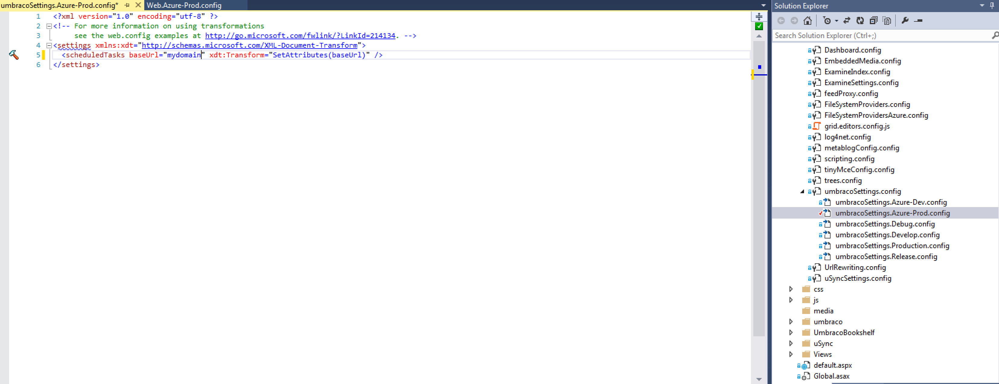

#Environment Specific Configs#

Often you will need to specify a certain setting for one environment versus the other, take the [classic example](/Chapter 08 - Custom Errors/01 - Custom Error Setup.md) of the `customError` setting.

We usually want that set to `Off` for local development and set to `On` for production. Without a mechanism to ensure that setting gets updated correctly when deploying code, we're prone to accidentally leaving it set to `Off`.

##Web Transforms##
So .NET offers us a nice and easy way to *transform* the `web.config` based on an environment. This process requires at least two files, the `web.config` and a transform file. When the `web.config` is loaded, the transform changes certain attributes and values.

For this example we will use an Azure transformation. You can add a new transformation several ways, this method is the manual way:

First edit your VS project file and add this:

```xml
<None Include="Web.Azure.config">
      <DependentUpon>Web.config</DependentUpon>
</None>
```

Next create `Web.Azure.config` and place it next to  your web.config on the file system.

Inside that file place the following:

```xml
<?xml version="1.0" encoding="utf-8"?>

<!-- For more information on using web.config transformation visit http://go.microsoft.com/fwlink/?LinkId=125889 -->

<configuration xmlns:xdt="http://schemas.microsoft.com/XML-Document-Transform">
  <system.web>
    <customErrors mode="On" xdt:Transform="SetAttributes(mode)">
    </customErrors>
  </system.web>
</configuration>
```

So what does this transform do? It simply set's the custom errors attribute to `On` but only on Azure.

But how do we apply it to Azure only, how does it know? Well it's system specific on how you tell the environment what transform to use, but in Azure, set the following `Application Setting` key in the  web application configuration (on the Azure portal):

The key = `SCM_BUILD_ARGS`
 
The value = `-p:PublishProfile=Azure`

You can also use `WebDeploy` for if you are hosting on AWS and select the appropriate transform when creating a publishing profile.

##Transforming UmbracoSettings.config##
At first glance, you may have figured out that you cannot transform this file directly. Instead we will just trade out this file altogether because it is referenced in the `Web.config`

So if we created `UmbracoSettingsAzure.config` and wanted to use that instead of the default one (but only on Azure), your `Web.Azure.config` file would then look like this:

```xml
<?xml version="1.0" encoding="utf-8"?>

<!-- For more information on using web.config transformation visit http://go.microsoft.com/fwlink/?LinkId=125889 -->

<configuration xmlns:xdt="http://schemas.microsoft.com/XML-Document-Transform">
  <umbracoConfiguration>
    <settings configSource="config\umbracoSettingsAzure.config" xdt:Transform="SetAttributes(configSource)"/>
    <FileSystemProviders configSource="config\FileSystemProvidersAzure.config" xdt:Transform="SetAttributes(configSource)"/>
  </umbracoConfiguration>
  <imageProcessor>
    <caching configSource="config\imageprocessor\cacheAzure.config" xdt:Transform="SetAttributes(configSource)"/>
  </imageProcessor>
  
  <appSettings>
    <add key="umbracoUseSSL" value="true" xdt:Transform="SetAttributes" xdt:Locator="Match(key)"/>
  </appSettings>

  <system.web>
    <compilation debug="true" xdt:Transform="SetAttributes(debug)" />
    <customErrors mode="On" xdt:Transform="SetAttributes(mode)">
    </customErrors>
  </system.web>
</configuration>
```

So what is happening here? Well we are simply saying, "use this file instead" for the config sections listed. The example above also does other things like forcing SSL and some Image Processor config swapping.

Using transforms allows you to work with custom errors off without SSL locally and ensures they are all turned on in a specific environment.

##A Better Way##
So after understanding how transforms are configured manually, you might be wondering if there has got to be a better way?

Enter [SlowCheetah](https://visualstudiogallery.msdn.microsoft.com/69023d00-a4f9-4a34-a6cd-7e854ba318b5) which is a Visual Studio plugin that is presently in maintenance mode only (no future plans).
>Microsoft may be picking this functionality up in VS2015.

SlowCheetah bypasses the restriction that transforms can only be done on the `Web.Config`. This means you can simply right click on *any* `config` file and transforms will be created and performed just like the `Web.config`. 

Using the previous example with the `umbracoSettings.config`, you would no longer have to swap out the entire file. You could perform all the normal transformations on the file itself.



You can even preview the changes before having to push them to the server.

>Thank you to Stefan Kip and Sebastiaan Janssen for pointing out this plugin to use.

[<Back 09 - Others](09 - Others.md)
